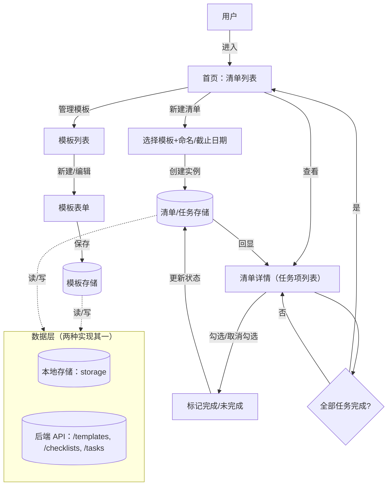
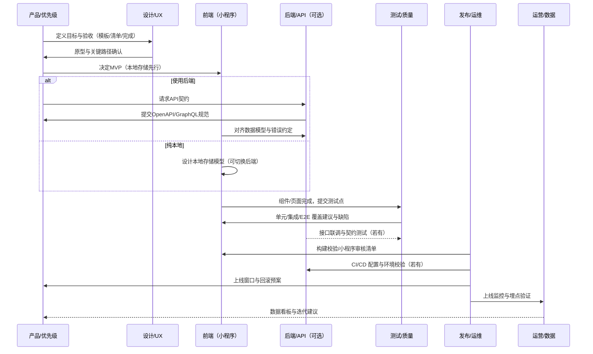

## 微信小程序清单项目计划（模板/任务/完成标记）

### 目标
- 创建清单模板
- 基于模板创建清单任务（实例）
- 对任务进行标记完成

### 岗位清单与执行顺序（从需求到上线）
1. 产品/优先级 – `agents/product/sprint-prioritizer.md`
   - 明确验收标准（模板字段、任务实例化规则、完成判定）与范围边界（MVP 可仅本地存储）
2. API 设计（可选，若使用后端） – `agents/universal/api-architect.md`
   - 资源模型与接口：模板、清单实例、任务项；分页/筛选/错误格式
3. 后端开发（可选，若使用后端） – `agents/universal/backend-developer.md`
   - 数据模型与接口实现：模板 CRUD、基于模板生成清单实例、任务完成状态更新
4. 前端开发（微信小程序） – `agents/universal/frontend-developer.md`
   - 页面/组件/状态管理：模板管理、清单创建、清单详情、任务勾选
5. 测试自动化 – `agents/testing/test-automator.md`
   - 单元/集成/E2E 核心路径：创建模板 -> 基于模板创建清单 -> 勾选完成
6. 发布编排 – `agents/project-management/project-shipper.md`
   - 提交审核与发布节奏、上线监控与回滚预案
7. 部署工程（可选） – `agents/deployment/deployment-engineer.md`
   - 配置 CI（小程序代码质量/单测）、后端（若有）的构建与部署

> 最小落地建议：先用小程序本地存储完成 MVP（无需后端），验证体验后再引入后端（云开发/自建 API）。

### 端到端流程图

### MVP 范围与关键验收
- 模板：名称、任务项列表（文本、默认是否勾选可选）
- 清单实例：引用模板、标题/备注、生成任务项（带 `completed` 状态）
- 勾选任务：单项切换完成；全部完成时首页展示已完成标记
- 数据持久化：MVP 使用本地存储；后续可切换到后端 API 而不改动前端领域模型

### 里程碑（建议）
- D0.5：冲刺规划与验收标准（1）
- D1：前端脚手架与本地存储抽象（4）
- D2：模板与清单页面联通（4）
- D3：E2E/集成测试主路径（5）
- D4：可选 API 设计与后端雏形（2,3）
- D5：打磨与发布编排（6,7）

### 参与岗位（扩展）
- 设计：
  - `agents/design/ui-ux-master.md`（信息架构与关键路径体验）
  - `agents/design/ui-designer.md`（界面与组件态）
  - `agents/design/ux-researcher.md`（可用性快速验证）
  - `agents/design/brand-guardian.md`（基于品牌一致性约束）
- 工程：
  - 前端：`agents/engineering/frontend/senior-frontend-architect.md`（小程序架构与状态模型）
  - 移动：`agents/engineering/frontend/mobile-app-builder.md`（移动端性能与交互细节）
  - 中台：`agents/engineering/middlend/code-reviewer.md`、`agents/engineering/middlend/devops-automator.md`
  - 后端：`agents/engineering/backend/backend-architect.md`
- 通用：
  - `agents/universal/frontend-developer.md`、`agents/universal/backend-developer.md`、`agents/universal/api-architect.md`
- 测试与质量：
  - `agents/testing/test-automator.md`、`agents/testing/api-tester.md`、`agents/testing/workflow-optimizer.md`
- 部署与运维：
  - `agents/deployment/deployment-engineer.md`、`agents/deployment/performance-engineer.md`、`agents/deployment/security-auditor.md`、`agents/deployment/error-detective.md`
- 项目与发布：
  - `agents/project-management/project-shipper.md`、`agents/project-management/studio-producer.md`
- 营销增长（上线后放量，可选）：
  - `agents/marketing/app-store-optimizer.md`、`agents/marketing/growth-hacker.md`、`agents/marketing/content-creator.md`
- 运营支持：
  - `agents/studio-operations/analytics-reporter.md`、`agents/studio-operations/support-responder.md`、`agents/studio-operations/legal-compliance-checker.md`

### 跨岗位泳道流程（协作视角）

